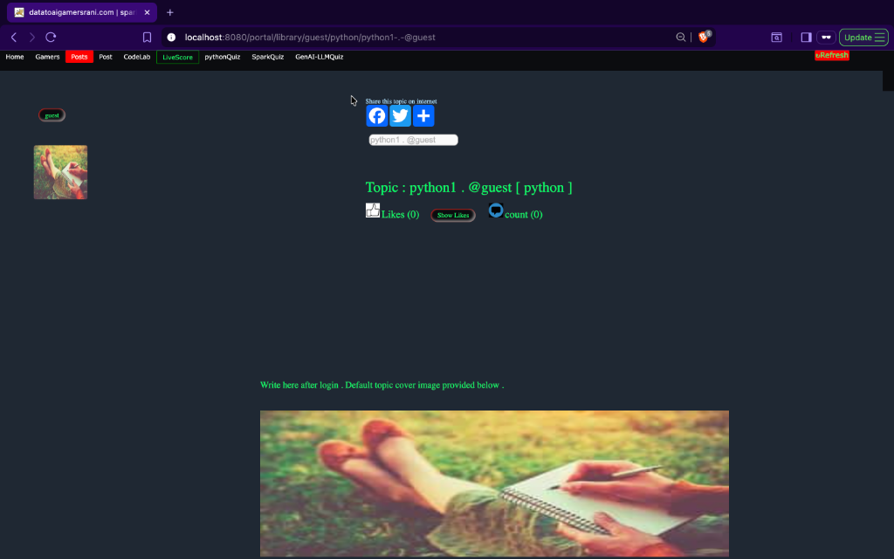
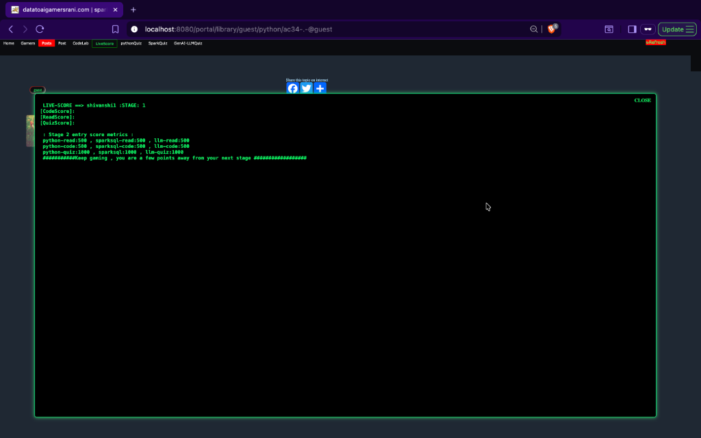
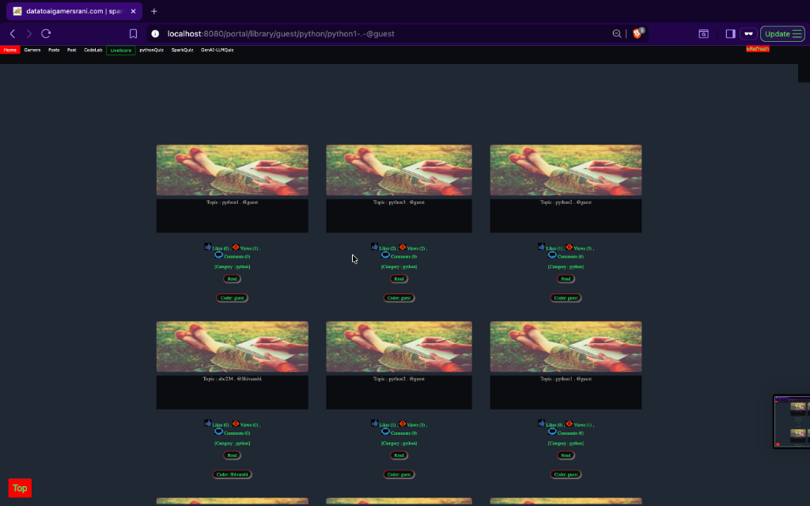
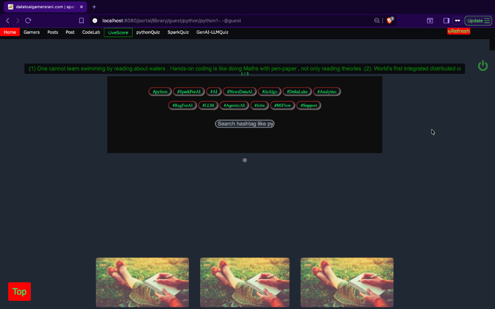

# Green Theme Portal 🟢

Welcome to the Green Theme Portal. This project provides a sleek, terminal-inspired "Matrix" green aesthetic for web applications.

## 🎨 Global Green Theme CSS

Add the following code to your project's stylesheet or inject it via a script to apply the theme globally.

```css
/* ===== Global Green Theme ===== */

body,
p,
span,
div,
h1, h2, h3, h4, h5, h6,
a,
button,
label,
li {
  color: #00ff66 !important;
}

/* Links */
a {
  text-decoration: none;
}

/* Buttons */
button {
  background-color: black;
  border: 1px solid #00ff66;
  padding: 8px 16px;
  cursor: pointer;
  transition: all 0.3s ease;
}

button:hover {
  background-color: #00ff66;
  color: black !important;
}
```

### 🛠 How to apply

To use this code in your script, you can inject it into the document head:

```javascript
const style = document.createElement('style');
style.textContent = `
/* ... paste the CSS code here ... */
`;
document.head.appendChild(style);
```

---

## 📸 Project Gallery

A showcase of the Green Theme applied across various sections of the platform.

<table align="center">
  <tr>
    <td align="center">
      <br/>
      <b>Dashboard / Topic View</b>
    </td>
    <td align="center">
      <br/>
      <b>Live Score Statistics</b>
    </td>
  </tr>
  <tr>
    <td align="center">
      <br/>
      <b>Topic Explorer</b>
    </td>
    <td align="center">
      <br/>
      <b>Search & Navigation</b>
    </td>
  </tr>
</table>

---
Designed for the ultimate gaming and coding experience.
